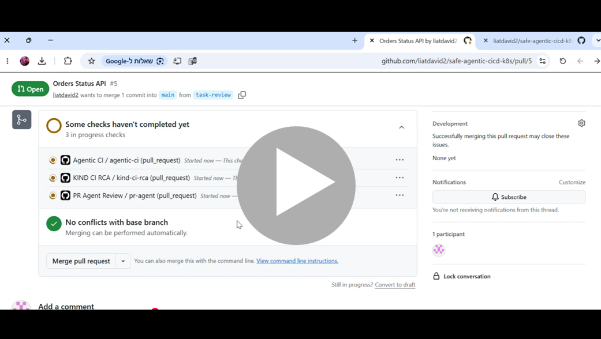

# Safe Agentic CI/CD with Kubernetes Deployment Analysis Agent

Built an AI-powered DevOps project that integrates specialized agents into a Kubernetes CI/CD workflow.

The system runs in GitHub Actions, creates a temporary KIND Kubernetes cluster, builds and loads Docker images, deploys a FastAPI service, collects real Kubernetes deployment evidence, and runs an LLM-based agent to analyze the deployment result directly inside the CI logs.

This project demonstrates how AI agents can support CI/CD and Kubernetes operations in a controlled, auditable, and reproducible way.

## What This Project Includes

- PR review agent
- Security scan agent
- Kubernetes deployment analysis agent
- GitHub issue automation
- Approval gate
- Secrets and ConfigMaps
- KIND-based CI/CD validation
- Docker image loading into Kubernetes
- LLM-generated deployment analysis report

# Demo: How AI Agents Support CI/CD and Kubernetes Operations
The video shows a Pull Request that adds a new API endpoint, runs automated PR review, security approval, CI validation, and a Kubernetes deployment test inside a temporary KIND cluster. After deployment, an LLM-based agent analyzes live Kubernetes evidence and prints a deployment analysis report directly in the GitHub Actions logs.
[](https://youtu.be/UOc19Gp_O-M)

## What This Project Shows

This project demonstrates three CI/CD capabilities:

1. Main CI workflow
2. Security approval gate
3. Kubernetes deployment test with KIND and an analysis agent

The pipeline does not only build code. It also creates a temporary Kubernetes cluster, deploys the service, checks if it is healthy, collects Kubernetes evidence, and generates a deployment analysis report.

## Simple Architecture

```text
Developer opens Pull Request
        |
        v
GitHub Actions
        |
        +--> Main CI
        |
        +--> PR Agent Review
        |
        +--> Security Approval
        |
        +--> KIND Kubernetes Deployment Test
                 |
                 v
          Temporary Kubernetes Cluster
                 |
                 v
          Deploy Orders API
                 |
                 v
          Collect Kubernetes Evidence
                 |
                 v
          Run Deployment Analysis Agent
                 |
                 v
          Print Report in CI Logs
```

## CI/CD Components

### 1. Main CI

This is the main CI validation workflow.

In GitHub Actions, it appears as:

```text
Agentic CI / agentic-ci
```

This check validates that the repository and API code can pass the basic CI steps.

Example result:

```text
Agentic CI / agentic-ci - Successful
```

### 2. PR Agent Review

This project includes an automated PR review workflow.

In GitHub Actions, it appears as:

```text
PR Agent Review / pr-agent
```

The purpose of this workflow is to demonstrate an agentic review step as part of the Pull Request process.

It gives the PR a more realistic engineering workflow:

```text
Code change
Automated review
CI validation
Security approval
Kubernetes deployment test
```

This is useful because real engineering teams often review changes before merging them into the main branch.

### 3. Security Approval

This project includes a security approval gate.

In GitHub Actions, it appears as:

```text
Agentic CI / security-approval
```

The purpose of this step is to show that security-sensitive changes can require approval before the workflow is considered complete.

This is useful for demonstrating:

```text
Controlled CI/CD
Manual approval for risky changes
Security-aware delivery flow
```

### 4. Kubernetes Deployment Test with KIND

This is the Kubernetes deployment validation workflow.

In GitHub Actions, it appears as:

```text
KIND CI RCA / kind-ci-rca
```

Although the workflow name contains `RCA`, the simple meaning is:

```text
Kubernetes deployment analysis
```

KIND means Kubernetes in Docker. It allows the CI pipeline to create a temporary Kubernetes cluster inside GitHub Actions without using a cloud Kubernetes service.

The workflow does the following:

```text
Create a temporary KIND cluster
Build the Orders API Docker image
Build the agent Docker image
Load both images into KIND
Deploy the Orders API to Kubernetes
Wait until the deployment is healthy
Collect Kubernetes evidence
Run the deployment analysis agent
Print the report in the CI logs
Upload the report as a CI artifact
```

## What Is a Deployment Analysis Report?

A deployment analysis report explains what happened during the Kubernetes deployment.

If something failed, the report tries to explain the likely reason.

For example:

```text
The pod failed because the Docker image was not found.
The pod failed because a Kubernetes Secret was missing.
The deployment failed because the health check did not pass.
```

If everything worked, the report says that no issue was detected.

In traditional DevOps, this kind of report is often called Root Cause Analysis.

Root Cause Analysis means finding the likely reason for a problem.

In this project, the report is generated automatically from real Kubernetes evidence.

## What Is the Agent?

The agent is a Python component that reads Kubernetes evidence and generates a human-readable deployment report.

It receives information such as:

```text
Pod status
Deployment status
Service status
Application logs
Kubernetes events
```

Then it creates a structured report with:

```text
Service name
Symptoms
Evidence
Likely cause
Recommended action
Follow-up tests
```

In this project, the agent runs after the Orders API is deployed.

## Orders API

The sample service is the Orders API.

It is deployed to Kubernetes using:

```text
k8s/orders-deployment.yaml
k8s/orders-service.yaml
```

The deployment runs two replicas:

```yaml
replicas: 2
```

The deployment uses this Docker image:

```yaml
image: orders-api:kind
imagePullPolicy: Never
```

This is important because the image is built inside GitHub Actions and loaded directly into the temporary KIND cluster.

## Agent Job

The deployment analysis agent runs as a temporary Kubernetes Job.

A Kubernetes Job is used for a task that runs once and then finishes.

In this project:

```text
orders-api          = service that keeps running
devops-agent-rca    = temporary job that analyzes the deployment
```

The job runs the agent code:

```bash
python -m agents.agent_runner \
  --mode rca \
  --evidence-file /evidence/deployment_evidence.txt \
  --out /tmp/rca_from_job.md
```

Then it prints the report:

```bash
cat /tmp/rca_from_job.md
```

## Example Successful Report

Example output from GitHub Actions:

```text
===== RCA REPORT =====

# Incident Report: Orders API Deployment

## Service
Orders API

## Symptoms
- Successful deployment of the Orders API with 2 replicas.
- Both pods are in a Running state.
- Health checks returning 200 OK.

## Evidence
- Deployment status: 2/2 replicas available.
- Both Orders API pods are running.
- Logs show successful application startup and health checks.

## Likely Root Cause
No issues detected during the deployment process.

## Recommended Action
Monitor the Orders API for errors or performance issues.

## Follow-Up Tests
1. Run load testing.
2. Monitor application logs.
3. Verify that the health endpoint remains responsive.
```

This means the Kubernetes deployment worked successfully.

## GitHub Actions Result

A successful run shows:

```text
KIND CI RCA / kind-ci-rca - Successful
```

This means:

```text
The temporary Kubernetes cluster was created.
The Docker images were built.
The images were loaded into Kubernetes.
The Orders API was deployed.
The deployment became healthy.
The analysis agent ran successfully.
The report was printed in the CI logs.
```

## Required GitHub Secrets

The agent uses MINIGPT or another LLM backend.

The following GitHub Secrets are required:

```text
MINIGPT_API_KEY
MINIGPT_CHAT_URL
MINIGPT_MODEL
```

Optional secrets:

```text
MINIGPT_TEMPERATURE
MINIGPT_TIMEOUT_SECONDS
AGENT_GITHUB_TOKEN
```

Secrets are configured in GitHub:

```text
Repository Settings
Secrets and variables
Actions
Repository secrets
```

## Main Files

```text
.github/workflows/kind-ci.yml
```

Runs the KIND-based Kubernetes CI workflow.

```text
k8s/orders-deployment.yaml
```

Deploys the Orders API into Kubernetes.

```text
k8s/orders-service.yaml
```

Creates the Kubernetes service for the Orders API.

```text
k8s/agent-job-template.yaml
```

Runs the deployment analysis agent as a temporary Kubernetes Job.

```text
agents/agent_runner.py
```

Runs the agent logic.

```text
services/orders-api/
```

Contains the Orders API service.

## Local Test

The same flow can also be tested locally with KIND.

Create the cluster:

```bash
kind create cluster --name safe-agentic-demo
```

Build the images:

```bash
docker build -t orders-api:kind -f services/orders-api/Dockerfile .
docker build -t devops-agent-runner:latest -f agents/Dockerfile .
```

Load the images into KIND:

```bash
kind load docker-image orders-api:kind --name safe-agentic-demo
kind load docker-image devops-agent-runner:latest --name safe-agentic-demo
```

Create the namespace:

```bash
kubectl create namespace agentic-devops --dry-run=client -o yaml | kubectl apply -f -
```

Deploy the Orders API:

```bash
kubectl apply -f k8s/orders-deployment.yaml
kubectl apply -f k8s/orders-service.yaml
```

Check the deployment:

```bash
kubectl get pods -n agentic-devops
kubectl get deployments -n agentic-devops
```

Run the agent job:

```bash
kubectl delete job devops-agent-rca -n agentic-devops --ignore-not-found
kubectl apply -f k8s/agent-job-template.yaml
kubectl logs job/devops-agent-rca -n agentic-devops
```

Expected output:

```text
===== RCA REPORT =====
```


## Summary

This repository demonstrates an agentic CI/CD system.

The pipeline deploys an application into a real temporary Kubernetes cluster, collects live deployment evidence, and runs an LLM-based agent that explains the deployment result.

The main value is that the CI/CD process does not only say pass or fail. It also provides a clear report explaining what happened.

````
